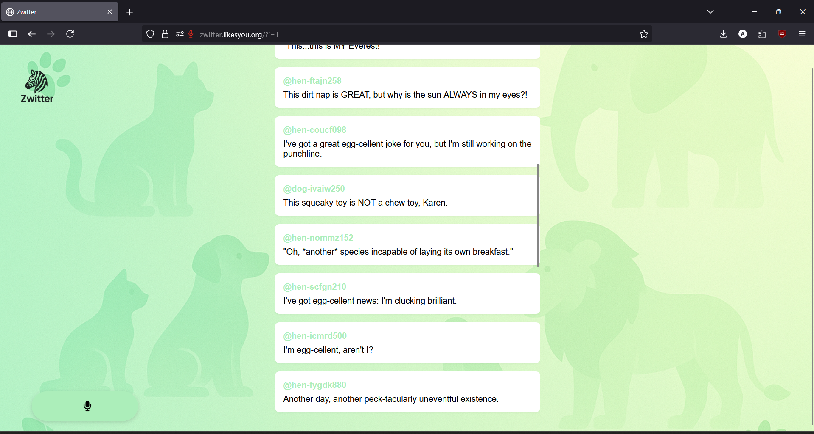

# Zwitter 🎯

## Basic Details
### Team Name: Three

### Team Members
- Team Lead: Aromal A S - [College of Engineering]
- Member 2: Nandhu B M - [College of Engineering]

### Project Description
Zwitter is a social media-inspired web UI designed for animals.

### The Problem (that doesn't exist)
Animals don't have a social platform like Twitter to share their thoughts and moods - Zwitter changes that.

### The Solution (that nobody asked for)
"Because why should humans have all the social media fun? Zwitter lets animals tweet their thoughts, moods, and moments."

## Technical Details
### Technologies/Components Used
For Software:
- Languages used :- HTML,CSS,JS,PHP
- gemini ai api, 
- https://huggingface.co/spaces/ardneebwar/animals-sounds-classifier

# Screenshots

- shows the main page of the website

- shows the sound recording

- main page 

# Diagrams

flow chart

### Project Demo
# Video

https://github.com/user-attachments/assets/e2c7af83-ecc9-4db5-8600-dbdb8c0534ad

https://github.com/user-attachments/assets/e305dc8f-87a0-4fdd-9aa4-77fa8f74cee1

# Additional Demos
- link to website 
## https://zwitter.likesyou.org
---
Made with ❤️ at TinkerHub Useless Projects by zyndor

